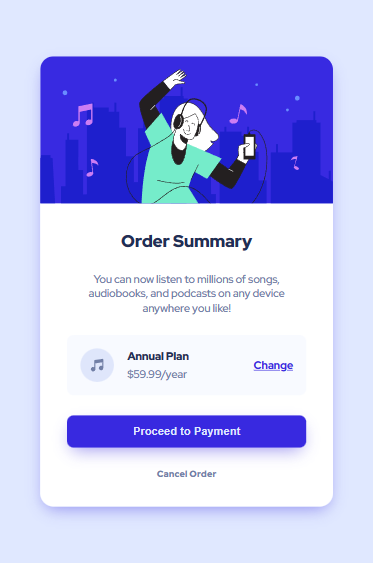
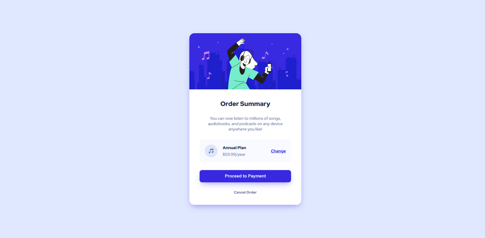

# Frontend Mentor - Order summary card solution

This is a solution to the [Order summary card challenge on Frontend Mentor](https://www.frontendmentor.io/challenges/order-summary-component-QlPmajDUj). Frontend Mentor challenges help you improve your coding skills by building realistic projects.

## Table of contents

- [Overview](#overview)
  - [The challenge](#the-challenge)
  - [Screenshot](#screenshot)
  - [Links](#links)
- [My process](#my-process)
  - [Built with](#built-with)
  - [What I learned](#what-i-learned)
  - [Continued development](#continued-development)
- [Author](#author)
- [Acknowledgments](#acknowledgments)

## Overview

### The challenge

Users should be able to:

- See hover states for interactive elements

### Screenshot




### Links

- Solution URL: [https://www.frontendmentor.io/solutions/responsive-order-summary-card-component-using-html-and-css-iUbzmcHDB4](https://your-solution-url.com)
- Live Site URL: [https://watt92imp.github.io/frontend-mentor-order-summary-component/](https://your-live-site-url.com)

## My process

### Built with

- Semantic HTML5 markup
- CSS custom properties
- Flexbox
- CSS Grid

### What I learned

Use this section to recap over some of your major learnings while working through this project. Writing these out and providing code samples of areas you want to highlight is a great way to reinforce your own knowledge.

To see how you can add code snippets, see below:

```html
<div class="card">
  <section class="card-header">
    
  </section>
  <section class="card-content">
    <h1 class="title">Order Summary</h1>
    <p class="desc">
      You can now listen to millions of songs, audiobooks, and podcasts on any
      device anywhere you like!
    </p>
    <div class="plan-container row btn">
      <div class="row">
        
        <div class="col">
          <p class="plan">Annual Plan</p>
          <p class="price">$59.99/year</p>
        </div>
      </div>
      <a href="#" class="btn-change">Change</a>
    </div>
    <button class="btn-payment">Proceed to Payment</button>
    <a href="" class="btn-cancel">Cancel Order</a>
  </section>
</div>
```

```css
@import url("https://fonts.googleapis.com/css2?family=Red+Hat+Display:wght@500;700;900&display=swap");
:root {
  --Pale-blue: hsl(225, 100%, 94%);
  --Bright-blue: hsl(245, 75%, 52%);
  --Very-pale-blue: hsl(225, 100%, 98%);
  --Desaturated-blue: hsl(224, 23%, 55%);
  --Dark-blue: hsl(223, 47%, 23%);
}
* {
  margin: 0;
  padding: 0;
  box-sizing: border-box;
}
body {
  display: flex;
  min-height: 100vh;
  align-items: center;
  justify-content: center;
  font-family: "Red Hat Display", sans-serif;
  background-color: var(--Pale-blue);
}
.card {
  margin: 2rem;
  width: 100%;
  max-width: 350px;
  display: flex;
  flex-direction: column;
  border-radius: 1rem;
  box-shadow: 0 8px 20px -6px hsla(245, 75%, 52%, 0.5);
}
.row {
  display: flex;
  flex-direction: row;
  gap: 1rem;
  align-items: center;
  justify-content: space-between;
}
.btn {
  background-color: hsla(225, 100%, 98%, 0.75);
  border-radius: 0.5rem;
  width: 100%;
  padding: 1rem;
}
.card-header {
  width: 100%;
  height: 11rem;
}
.card-header img {
  height: 100%;
  width: 100%;
  max-width: 100%;
  object-fit: fill;
  border-radius: 1rem 1rem 0 0;
}
.card-content {
  gap: 1.5rem;
  padding: 2rem;
  display: flex;
  align-items: center;
  flex-direction: column;
  background-color: hsl(0, 0%, 100%);
  border-radius: 0 0 1rem 1rem;
}
.card-content .title {
  font-weight: 900;
  font-size: 1.25rem;
  color: var(--Dark-blue);
}
.card-content .desc {
  text-align: center;
  font-size: 0.8rem;
}
.card-content p {
  color: var(--Desaturated-blue);
  font-weight: 500;
  font-size: 0.8rem;
}
.icon {
  width: 40px;
  height: 40px;
}
.col {
  display: flex;
  flex-direction: column;
  gap: 0.25rem;
}
.plan {
  font-weight: 900 !important;
  color: var(--Dark-blue) !important;
}
.btn-change {
  color: var(--Bright-blue);
  font-weight: 700;
  font-size: 0.8rem;
}
.btn-payment {
  width: 100%;
  border-radius: 0.5rem;
  padding: 0.7rem;
  font-weight: 700;
  color: var(--Pale-blue);
  border-style: none;
  background-color: var(--Bright-blue);
  box-shadow: 0 8px 20px -6px hsla(245, 75%, 52%, 0.5);
}
.btn-cancel {
  text-decoration: none;
  font-weight: 900;
  font-size: 0.7rem;
  color: var(--Desaturated-blue);
}
.btn-cancel:hover {
  color: var(--Dark-blue);
  cursor: pointer;
}
.btn-payment:hover {
  cursor: pointer;
  color: hsl(0, 0%, 100%);
  background-color: hsla(245, 75%, 52%, 0.6);
}
.btn-change:hover {
  cursor: pointer;
  text-decoration: none;
  color: hsla(245, 75%, 52%, 0.6);
}
```

### Continued development

Use this section to outline areas that you want to continue focusing on in future projects. These could be concepts you're still not completely comfortable with or techniques you found useful that you want to refine and perfect.

## Author

- Frontend Mentor - [@watt92imp](https://www.frontendmentor.io/profile/@watt92imp)
- Twitter - [@iWatt992](https://www.twitter.com/@iWatt992)

**Note: Delete this note and add/remove/edit lines above based on what links you'd like to share.**

## Acknowledgments

This is where you can give a hat tip to anyone who helped you out on this project. Perhaps you worked in a team or got some inspiration from someone else's solution. This is the perfect place to give them some credit.
